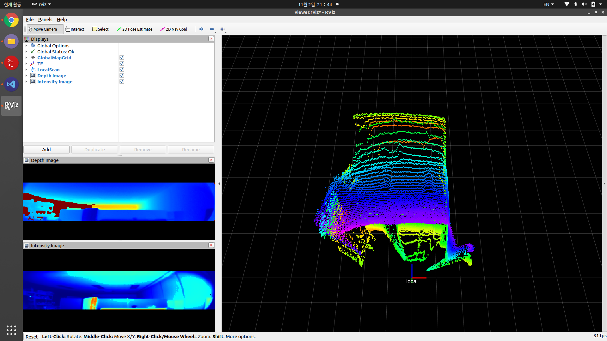

# iLidar ROS Package
Ready to Use: This ROS package can be used to integrate our sensor into your application based on ROS environment.

## Overview
This package can read depth and intensity data from our sensor. Currently, the goal of this package is to read the data from iLidar-ToF:iTFS, and reconstruct them to the 3D point cloud with the basic camera model.

## Requirement
This package has been developed on `ROS noetic`. But we check that this package is also built on `ROS melodic` and `ROS kinetic`.
In this package, we use the following ROS packages:

```bash
rosconsole
roscpp
cv_bridge
pcl_ros
pcl_conversions
sensor_msgs
image_transport
```

## Development Environment
This repository has been built and tested with real sensors in the following environment:
|ROS Distribution|Version|Docker Image|
|:--------------:|:-----:|:-----------|
|ROS kinetic|1.12.17|[osrf/ros:kinetic-desktop-full]|
|ROS melodic|1.14.13|[osrf/ros:melodic-desktop-full]|
|ROS noetic|1.16.0|[osrf/ros:noetic-desktop-full]|

If you want to test the sensor on docker images, follow instructions in ROS-DOCKER.txt file.

## How to Build
After the installation ROS and its dependencies for building packages, call the catkin command
```
$ catkin_make
```
at the same directory with this README file. 

## Set Launch File
Open `/src/launch/viewer.launch` and set the following value. For more detailed descriptions, check the software manual.
```html
<param name="mapping_file"    type="string"     value="$(find ilidar)/src/iTFS-110.dat"   />
```
Use `value="$(find ilidar)/src/iTFS-110.dat"` for iTFS-110 or `"$(find ilidar)/src/iTFS-80.dat"` for iTFS-80

## Launch
Launch the viewer with the command:
```bash
$ source ./devel/setup.bash
$ roslaunch ilidar viewer.launch 
```

## Example
When the sensor is working properly, the example display is shown like:

  
You can see the depth and intensity images at below windows, which topics are published as 
```html
/ilidar/depth
/ilidar/intensity
```
and the reconstructed 3D cloud points are also shown at the main display with 'local' frame. The 3D points can be used with the topic:
```html
/ilidar/points
```

For gray scale mode, press Add > By topic > /gray/Image and check OK button. If you don't use 940 nm external IR light source, you will see almost nothing.
```html
/ilidar/gray
```

## Topic details

### /ilidar/depth

The depth image from the sensor. The data type of the image is "mono16" with mm-unit, when you configure "colormap" to "false". When you set "colormap" to "true", the data type will be "rgb8". This topic is published by image_transport::ImageTransport. You can find the code block on [L#334 @ilidar-ros.cpp].

### /ilidar/intensity

The intensity image from the sensor. This topic has the same format with the depth image.

### /ilidar/points

The reconstructed point cloud from the sensor. The type of point is "pcl::PintXYZI". This topic is published by sensor_msgs::PointCloud2. You can find the code block on [L#298 @ilidar-ros.cpp].

### /ilidar/gray

Gray image from the sensor. Valid for only mode 4. This topic is published by image_transport::ImageTransport.

## How to access the raw depth image

You can see the reception proccese in [L#262 @ilidar-ros.cpp] as following:
```cpp
...
/* Main loop starts here */
int recv_device_idx = 0;
while (ros::ok()) {
	// Wait for new data
	std::unique_lock<std::mutex> lk(lidar_cv_mutex);
	lidar_cv.wait(lk, []{ return !lidar_q.empty(); });
	recv_device_idx = lidar_q.front();
	lidar_q.pop();

	// Check the main loop underrun
	if (!lidar_q.empty()) {
		/* The main loop is slower than data reception handler */
		printf("[WARNING] iTFS::LiDAR The main loop seems to be slower than the LiDAR data reception handler.\n");

		// Flush the queue
		while (!lidar_q.empty()) { recv_device_idx = lidar_q.front(); lidar_q.pop(); }
	}

	/* Main processing starts here */
	...
}
```
After waiting `lidar_cv.wait()`, the raw depth data is stored at `lidar_img_data` which has the mm units. So, you can access the data in pixel as shown in the above.

## License
All example projects are licensed under the MIT License. Copyright 2022-Present HYBO Inc.

[osrf/ros:kinetic-desktop-full]: https://hub.docker.com/layers/osrf/ros/kinetic-desktop-full/images/sha256-b9c9d7c2db12796067e650dd2095712e6eb93ff47ab5c3d2664712d3981208b0?context=explore
[osrf/ros:melodic-desktop-full]: https://hub.docker.com/layers/osrf/ros/melodic-desktop-full/images/sha256-bd515b87a9aaf6eda83e5061012e1c0cdb29fba5c5454ecefb1654ad6c8cfea6?context=explore
[osrf/ros:noetic-desktop-full]: https://hub.docker.com/layers/osrf/ros/noetic-desktop-full/images/sha256-3ea4fa2e551bf72cf29481643da333220928f66c807e669583787f4f4b85f748?context=explore
[L#334 @ilidar-ros.cpp]: https://github.com/ilidar-tof/ilidar-api-ros/blob/main/src/ilidar-ros.cpp#L334
[L#298 @ilidar-ros.cpp]: https://github.com/ilidar-tof/ilidar-api-ros/blob/main/src/ilidar-ros.cpp#L298
[L#262 @ilidar-ros.cpp]: https://github.com/ilidar-tof/ilidar-api-ros/blob/main/src/ilidar-ros.cpp#L262
